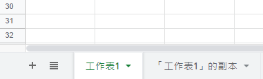
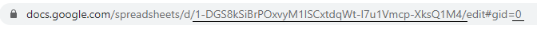

[](https://github.com/deflinhec/GodotGoogleSheet/blob/master/LICENSE) 
[](https://github.com/deflinhec/GodotGoogleSheet/releases/)
[](https://github.com/deflinhec/GodotGoogleSheet/graphs/commit-activity)
# GodotGoogleSheet - Google Spreadsheet download plugin for GDScript.

A plugin written in GDScript which downloads google spreadsheet with Google Sheet api v4.


## :label: Spreadsheet configuration

First, generate [Google API key](https://developers.google.com/sheets/api/guides/authorizing#APIKey) through this guide.


Second, locate to your spreadsheet id and sheet name.

```
https://docs.google.com/spreadsheets/d/[SPREADSHEET_ID]/edit#gid=0
```





Finally, defined an array which contains all spreadsheets and preload script.

```gdscript
const SPREADSHEETS: Array = [
    ["res://datas/test.json",                        # File to write and read.
    "1-DGS8kSiBrPOxvyM1ISCxtdqWt-I7u1Vmcp-XksQ1M4",  # SpreadSheetID.
    "工作表1"],                                      # Sheet name.
]

const API_KEY: String = "YOUR GOOGLE API KEY"

const GSheet = preload("res://addons/google_sheet/gsheet.gd")

const GVersion = preload("res://addons/google_sheet/gversion.gd")

const GConfig = preload("res://addons/google_sheet/config.gd")
```

## :bookmark: Examples

- ### Download sheets from google sheet api v4.
  
  Download files and load into memory.

  ```gdscript
  var host = GConfig.Host.new(API_KEY)

  var gsheet : GSheet = GSheet.new(SPREADSHEETS, host)

  var datas: Dictionary = {}

  func _ready():
    gsheet.connect("allset", self, "_on_allset")
    gsheet.connect("complete", self, "_on_complete")
    gsheet.start([GSheet.JOB.DOWNLOAD])
    
  func _on_complete(name: String, data: Dictionary):
    datas[name] = data
    
  func _on_allset():
    pass # do some extra logic after completion
  ```

- ### Load sheets from file.

  Assuming files are already exist within your local filesystem.

  ```gdscript
  var host = GConfig.Host.new(API_KEY)

  var gsheet : GSheet = GSheet.new(SPREADSHEETS, host)

  var datas: Dictionary = {}

  func _ready():
    gsheet.connect("complete", self, "_on_complete")
    gsheet.connect("allset", self, "_on_allset")
    gsheet.start([GSheet.JOB.LOAD])
    
  func _on_complete(name: String, data: Dictionary):
    datas[name] = data
    
  func _on_allset():
    pass # do some extra logic after completion
  ```

- ### Run md5 checksum before downloads.

  This feature use a dedicate service which can be download here [gsx2json-go](https://github.com/deflinhec/gsx2json-go).

  ```gdscript
  var host = GConfig.Gsx2JsonGoHost.new(API_KEY, "localhost", 8080)

  var gversion: GVersion = GVersion.new(SPREADSHEETS, host)

  var gsheet : GSheet = GSheet.new(gversion, host)
  
  var datas: Dictionary = {}
  
  var requestbytes: int = 0
  
  var outdated: Array = []

  func _ready():
    gversion.connect("complete", self, "_on_complete")
	gversion.connect("request", self, "_on_request")
    gsheet.connect("complete", self, "_on_complete")
    gsheet.connect("allset", self, "_on_allset")
    gversion.start()
    
  func _on_complete(name: String, data: Dictionary):
    datas[name] = data
    
  func _on_request(array: Array, bytes: int):
	requestbytes = bytes
	outdated = array
    
  func _on_allset():
    pass # do some extra logic after completion
  ```

## :coffee: [Buy me a coffee](https://ko-fi.com/deflinhec) 
